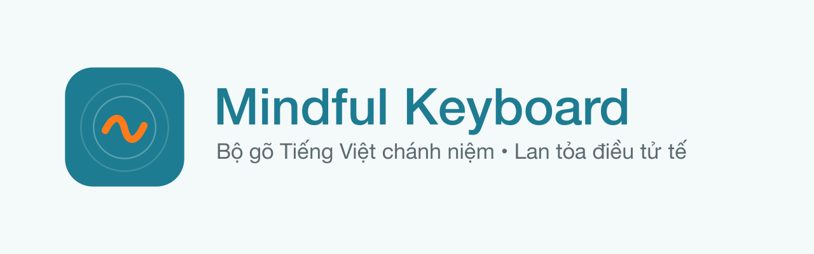

<p align="center">
  
</p>

<h1 align="center">Mindful Keyboard</h1>

<p align="center">
  <strong>Bộ gõ Tiếng Việt giúp bạn gõ trong tỉnh thức.</strong><br>
  Người gác cổng cảm xúc — chèn một nhịp thở trước khi bạn gửi đi điều 5 phút sau sẽ hối tiếc.
</p>

<p align="center">
  
  
  
  
</p>

<p align="center">
  <a href="#cài-đặt">Cài đặt</a> ·
  <a href="#nó-làm-gì">Nó làm gì</a> ·
  <a href="#cách-nó-cảm-và-ghi-nhận">Cách nó cảm</a> ·
  <a href="#riêng-tư-mặc-định">Riêng tư</a> ·
  <a href="#phát-triển">Phát triển</a> ·
  <a href="#ghi-nhận-nguồn--giấy-phép">Ghi nhận nguồn</a>
</p>

---

Ngày xưa, một tiếng chuông giữa ngày đủ để ta dừng lại và thở. Lá thư đi mất mấy hôm; giận thì "để mai
tính". Đời tự cài sẵn những khoảng dừng.

Hôm nay, từ cơn giận đến nút **Gửi** chỉ còn hai giây và một ngón tay. Mặt kính đã lấy mất khoảng dừng
ấy. **Mindful Keyboard** đặt nó trở lại — ngay trong bàn phím, nơi con chữ vừa thành hình. Không phán
xét, không chấm điểm, chỉ **mời** bạn thở một nhịp.

> **Chánh niệm trước, tính năng sau.** Đây là một bộ gõ Tiếng Việt tử tế, không phải một bảng liệt kê
> tính năng.

## Nó làm gì

- **Gõ Tiếng Việt mượt** — Telex / VNI / VIQR, bỏ dấu thông minh, macro gõ tắt, chuyển mã. Lõi kế thừa
  từ [OpenKey](https://github.com/tuyenvm/OpenKey), chuẩn và nhanh ở mọi app.
- **Người gác cổng** — khi câu bạn sắp gửi đang nóng, một nhịp thở hiện lên. Bạn vẫn toàn quyền gửi;
  chỉ là không phải trong lúc chưa kịp thở. *(macOS)*
- **Con sóng, không phải điểm số** — trạng thái tâm hiện qua **biên độ** của dấu ngã `~`, sắc độ trung
  tính. Mô tả hiện tượng ("Mặt hồ đang gợn sóng"), không dán nhãn tốt–xấu, không đèn đỏ, không mặt mếu.
- **Tiếng chuông tự đến** — nhắc nhẹ theo nhịp, tôn vinh cả những quãng lặng, không streak/điểm/huy chương.

## Cách nó cảm và ghi nhận

Nhiều người hỏi: app "tính điểm cảm xúc" thế nào? Câu trả lời: nó cảm *cách bạn gõ*, không phán xét
*bạn là ai* — và con số nội bộ đó **không bao giờ hiện ra cho bạn xem**.

- **Nhìn cách gõ** — chỉ khi bộ gõ bật và đang gõ Tiếng Việt; không đụng ô mật khẩu, không đọc khi tắt bộ gõ.
- **Mỗi câu → một mức cường độ** từ `0` (êm) đến `1` (căng). Con số ấy chỉ quyết định con sóng gợn cao hay thấp — **không hiển thị**.
- **Mỗi nhịp chuông ghi một chấm** lên dòng sông (bạn chọn 30 hay 60 phút). Lúc không gõ, sông để trống — không bịa số.
- **Ở lại trên máy** — nhật ký mã hoá cục bộ, khóa giữ trong Keychain.

> **Vì sao giấu con số?** Vì khoảnh khắc bạn thấy "hôm nay 7/10" là khoảnh khắc bạn bắt đầu thi đua với
> chính mình — đúng thứ chánh niệm muốn buông. App đưa tấm gương, không đưa điểm thi.

Cố ý **không** có: điểm số/phần trăm hiện ra · streak/huy hiệu/xếp hạng · đèn đỏ–xanh, mặt cười–mếu · lời khiển trách.

## Các màn hình

- **Bảng nhanh** (biểu tượng `~` trên thanh menu) — liếc là thấy, ba thẻ: **Hôm nay** (dòng sông cảm xúc +
  "Độ nhạy"), **Chuông** (nhịp lấy mẫu + bộ tiếng), **Bộ gõ** (Telex/VNI, bảng mã, tùy chọn).
- **Cửa sổ đầy đủ** — sáu mục: Hôm nay · Chuông · Bộ gõ · Riêng tư · Hệ thống · Giới thiệu.
- **Soi lại cuối ngày** — một câu hỏi để mang theo, không phải biểu đồ.

Hướng dẫn có hình đầy đủ (bản minh hoạ): [`docs/HUONG-DAN-SU-DUNG.html`](docs/HUONG-DAN-SU-DUNG.html) — mở trong trình duyệt.

## Riêng tư mặc định

Cảm xúc của bạn **không rời khỏi máy**. Mọi phân tích chạy ngay tại chỗ; nhật ký tâm trạng mã hóa cục
bộ, khóa giữ trong Keychain. Không máy chủ, không tài khoản, không một dòng nội dung nào được gửi đi.

## Cài đặt

- **macOS** (công dân hạng nhất) — tải bản `.dmg` mới nhất ở trang
  [Releases](../../releases/latest), kéo vào Applications, cấp quyền **Trợ năng** + **Giám sát nhập
  liệu**. Chưa tới một phút.
- **Windows** — đang phát triển, sẽ có ở Releases khi sẵn sàng.

> Bản hiện tại ký ad-hoc (chưa notarize) — xem `docs/INSTALL.md` nếu macOS chặn lần mở đầu.

## Phát triển

Bộ não gõ dùng chung (C++ thuần) + vỏ native từng hệ điều hành. Yêu cầu: Xcode +
[XcodeGen](https://github.com/yonaskolb/XcodeGen) (`brew install xcodegen`).

```bash
make generate   # xcodegen generate → sinh .xcodeproj
make build      # build app macOS (Debug, ký ad-hoc)
make run        # build rồi mở app
make test       # regression engine + test vỏ macOS/iOS
make brand      # xuất lại icon/asset từ brand/svg/ (1 nguồn → nhiều đích)
```

<details>
<summary><strong>Cấu trúc thư mục</strong></summary>

```
mindful-key/
├── core/
│   ├── engine/   ← Bộ não OpenKey (Telex/VNI/VIQR, bảng mã, macro). KHÔNG sửa "mù" — PR chạm
│   │               vào đây phải kèm test ở tests/core/.
│   └── mood/     ← MoodBuffer (gom từ→câu) + BreathingPause ("nhịp thở") — C++ thuần, dùng chung.
├── platforms/
│   ├── apple/    ← macOS (đầy đủ) + iOS (keyboard extension). XcodeGen: project.yml.
│   ├── windows/  ← vỏ Win32 gốc, chưa rebrand/chưa build trong monorepo này.
│   ├── android/  ← ghi chú lộ trình.
│   └── linux/    ← README thượng nguồn.
├── brand/        ← Nhận diện NOW BRAND OS: tokens.json + svg/ + export-*.sh (NGUỒN DUY NHẤT của màu).
├── site/         ← Landing page (HTML tĩnh, đọc cùng brand).
├── docs/         ← Hiến chương, PRD, spec, ghi chú riêng tư, REPO-TOPOLOGY.
├── scripts/      ← đóng gói .dmg, ký & notarize, phát hành.
└── tests/        ← core (regression engine) · macos · ios.
```

**Nhận diện chảy 1 nguồn → nhiều đích:** sửa màu/logo CHỈ ở `brand/tokens.json` + `brand/svg/`.
`make brand` sinh asset vào app; `make public-brand` sinh bộ mặt-tiền. Không hard-code màu ở nơi khác.
Chi tiết: `docs/REPO-TOPOLOGY.md`.
</details>

## Ghi nhận nguồn & giấy phép

Lõi engine gõ Tiếng Việt được **fork từ [OpenKey](https://github.com/tuyenvm/OpenKey) của
[Mai Vũ Tuyên](https://github.com/tuyenvm)** — xin trân trọng ghi nhận và cảm ơn tác giả. OpenKey là
**GPL v3**, nên Mindful Keyboard **cũng là GPL v3** (copyleft kế thừa).

- Phần kế thừa (`core/engine/`) giữ gần nguyên vẹn; phần viết thêm (`core/mood/`, lớp gác cổng &
  chánh niệm trên macOS) ghi rõ là dựa trên / mở rộng OpenKey.
- Toàn văn giấy phép: [`LICENSE`](LICENSE). Credit cũng hiển thị trong app (menu bar → Giới thiệu).
- Phát hành bản chạy (.dmg/.exe) luôn kèm mã nguồn tương ứng, theo đúng nghĩa vụ GPL v3.

## Hiến chương

Mọi quyết định kỹ thuật & nhận diện quy chiếu [`docs/AGENT-BRIEF.md`](docs/AGENT-BRIEF.md). Điều bất khả
xâm phạm: không đèn đỏ/xanh mã hóa cảm xúc · không emoji chấm điểm · không gamification · không copy
khiển trách. Tự kiểm mọi giao diện: *"Cái này đang mô tả hay đang phán xét?"* — phán xét thì bỏ.

## Ủng hộ

Mindful Keyboard miễn phí và mã nguồn mở, không quảng cáo, không bán dữ liệu. Nếu nó tặng bạn một nhịp
dừng, bạn có thể **tiếp sức tuỳ tâm** để nó đến với nhiều người hơn — hoặc chỉ cần **chia sẻ cho một
người** đang hay gõ vội lúc lòng nóng. Đó cũng là lan toả điều tử tế.

<p align="center"><sub>Một sản phẩm GNH · <em>Lan toả điều tử tế</em></sub></p>
