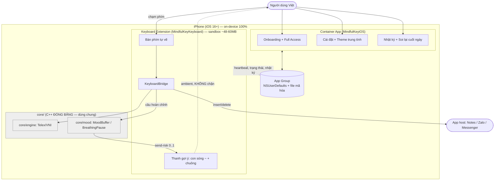

# 04 — Software Glance (Step 2)

> **Pha 2/4 · problem-based-srs Step 2.** Bức phác giải pháp cấp cao: ranh giới, actor, thành
> phần chính. Chưa đi vào requirement chi tiết (đó là Step 5). **2026-07-11.**

---

## 1. Một câu định vị
Một **bàn phím tiếng Việt chánh niệm cho iOS**: gõ Telex/VNI quen tay như Laban (qua `core/engine`
dùng chung), phủ thêm một **lớp quan sát cảm xúc thụ động** — con sóng `~` trên thanh gợi ý + tiếng
chuông + nhật ký on-device — tất cả trung tính, không phán xét, không rời máy.

## 2. Ranh giới hệ thống & Actor

## 3. Các thành phần chính (mô tả cấp cao)

| Thành phần | Thuộc | Vai trò | Trạng thái hiện tại |
|---|---|---|---|
| **Bàn phím tự vẽ** | Extension | Layout QWERTY + Telex/VNI, Shift/Caps, lớp số | 🟡 Mốc A (chèn thô) |
| **KeyboardBridge** | Extension | Cầu C++↔UIKit: `vKeyInit`/`vKeyHandleEvent` → `UITextDocumentProxy` | 🟡 mới init |
| **Thanh gợi ý (sóng + chuông)** | Extension | Con sóng `~` biến hình theo biên độ; âm chuông chánh niệm | ⬜ chưa |
| **Onboarding + Full Access** | Container | Dẫn kích hoạt bàn phím, minh bạch quyền | ⬜ chưa (có EXPERIENCE) |
| **Cài đặt + Theme** | Container | Preview sống, slider, Telex/VNI, theme trung tính | ⬜ chưa (có EXPERIENCE) |
| **Nhật ký + Soi lại** | Container | Nhật ký mã hóa on-device, câu phản chiếu | ⬜ chưa (phác) |
| **App Group store** | Chung | Heartbeat + trạng thái + file nhật ký mã hóa | ⬜ chưa |
| **core/engine, core/mood** | core (đóng băng) | Bộ não gõ + gom câu/nhịp thở | ✅ có, verify chạy iOS |

## 4. Ranh giới rõ (in/out)
- **In:** vỏ iOS (extension + container) tiêu thụ `core/` qua API.
- **Out:** sửa `core/`; gác cổng chặn gửi tin xuyên app (sandbox — chỉ "nhắc"); server/cloud (trừ sync theme opt-in ở round xa); vuốt phím + macro (đợt sau).

## 5. Luồng dữ liệu cảm xúc (khác Round 1 — chưa wire)
`gõ phím → KeyboardBridge → engine trả ký tự → (Round 2) BridgeMood gọi MoodBuffer gom câu →
send-risk → cập nhật biên độ con sóng ~ trên thanh gợi ý (ambient) + ghi App Group nhật ký mã hóa`.
Điểm mù: engine chỉ thấy chữ khi bộ gõ BẬT + tiếng Việt + không phải ô mật khẩu; model chạy bất
đồng bộ cuối câu (debounce), không chen mạch gõ phím.

---
*Step 2/5. Kế tiếp: `05-customer-needs.md` (CN — WHAT) → chạy `validate` sau Step 3.*
