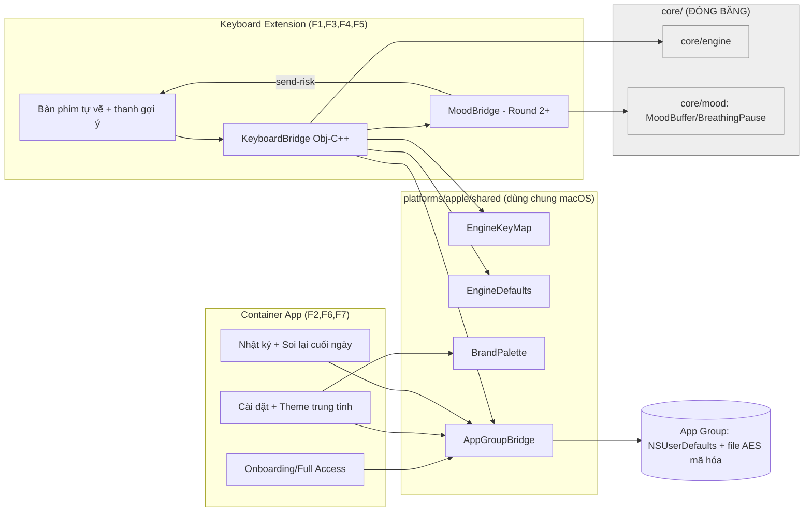

# 06 — Software Vision (Step 4)

> **Pha 2/4 · problem-based-srs Step 4.** Định vị, nhóm tính năng, kiến trúc mục tiêu của sản
> phẩm iOS đầy đủ. **2026-07-11.**

---

## 1. Positioning Statement
**Cho** người Việt gõ tiếng Việt trên iPhone **muốn** một bàn phím vừa quen tay vừa giúp mình chậm
lại một nhịp, **Mindful Key iOS là** một Custom Keyboard Extension gõ Telex/VNI qua bộ não OpenKey
dùng chung, **khác với** Laban Key và các bàn phím thương mại **ở chỗ** nó phủ một lớp quan sát cảm
xúc thụ động (con sóng `~`, tiếng chuông, nhật ký on-device) — trung tính, không phán xét, không
game hóa, không rời máy. **Khác với** bàn phím mindfulness phương Tây **ở chỗ** nó hiểu tiếng Việt.

## 2. Nhóm tính năng (Feature Themes) → gắn CN

| Nhóm | Mô tả | CN phục vụ | Nguồn kế thừa |
|---|---|---|---|
| **F1 · Lõi gõ** | Bàn phím Telex/VNI ra dấu qua `core/engine`, Shift/số/xóa/đổi bàn phím | CN-01, CN-02 | `core/engine` + layout Laban |
| **F2 · Onboarding & quyền** | Dẫn kích hoạt, minh bạch Full Access, heartbeat detection | CN-03, CN-04, CN-05 | UX onboarding Laban |
| **F3 · Riêng tư** | On-device 100%, loại ô mật khẩu, dữ liệu vận hành sạch nội dung | CN-06 | Cột trụ riêng tư + macOS |
| **F4 · Sóng cảm xúc** | Con sóng `~` ambient trên thanh gợi ý theo biên độ send-risk | CN-07 | `MoodBuffer` + Phương án A |
| **F5 · Tiếng chuông** | Âm chuông chánh niệm (preset âm và/hoặc nhắc nghỉ) | CN-08 | `BellMac` (macOS) + preset Âm Laban |
| **F6 · Cá nhân hóa** | Cài đặt + preview sống + slider + theme trung tính | CN-09 | Preview/slider Laban (bỏ game hóa) |
| **F7 · Nhật ký & soi lại** | Nhật ký mã hóa on-device + câu phản chiếu + soi lại cuối ngày | CN-10, CN-11 | `MoodStoreMac` + `ReflectionScreen` |
| **F8 · Nâng cao (round sau)** | Vuốt phím (swipe); sync theme opt-in | CN-12, CN-13 | Laban swipe. *(Gõ tắt macro tách sang R2 = FR-A15a, chốt 2026-07-11 — engine `Macro.cpp` sẵn có.)* |

## 3. Kiến trúc mục tiêu (đầy đủ)

## 4. Chặng phát hành (bản đồ vision → round; chi tiết ở `ROADMAP.md`)

| Round | Trọng tâm | Nhóm tính năng |
|---|---|---|
| **R1** Walking skeleton | Gõ Telex thật + onboarding | F1, F2, F3 |
| **R2** Bàn phím giống Laban + lớp cảm xúc nhẹ | Lõi đầy đủ + gõ tắt + sóng + chuông + cài đặt | F1(mở rộng), F4, F5, F6, F15a |
| **R3** Cá nhân hóa + nhật ký | Theme trung tính + nhật ký + soi lại | F6(mở rộng), F7 |
| **R4+** Nâng cao & phát hành | Vuốt phím (swipe), sync opt-in, ký/notarize/TestFlight | F8 |

## 5. Ràng buộc kiến trúc bất biến
- "1 bộ não + nhiều vỏ" — `core/` đóng băng, iOS bọc qua bridge, không fork logic gõ.
- Model cảm xúc chạy **bất đồng bộ cuối câu** (debounce), không chen mạch gõ phím.
- Mọi thứ chạm nhận diện (F4/F5/F7) qua hiến chương M1/M2 trước khi thi công.

## 6. Cross-reference
Bám `04-software-glance.md` (ranh giới/actor) + `05-customer-needs.md` (CN). Nhóm F1–F8 nở ra
thành FR ở Step 5 (`07-functional-requirements/`).

---
*Step 4/5. Kế tiếp: `07-functional-requirements/` + `07-non-functional/` → `validate` sau Step 5.*
