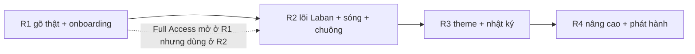

# ROADMAP — Mindful Key iOS (sản phẩm đầy đủ)

> **Pha 3/4 — deliverable chính.** Nối 17 FR (`07-functional-requirements/`) vào 4 chặng, mỗi
> hạng mục gắn trạng thái lấy từ Sổ cái Pha 0 (`00-input-ledger.md`): **✅ đã có · 🟡 cần hoàn
> thiện · ⬜ chưa bắt đầu**. Mỗi round có định nghĩa hoàn thành + rủi ro + quyết định cần chốt.
> **2026-07-11.**
>
> 🧭 Mọi round tuân hiến chương M1–M6 (xem `02-business-context.md` §2). Round chạm nhận diện
> (R2/R3) **không khởi công** phần ❓ trước khi chủ dự án chốt decision queue (`09-bmad-reconcile.md`).

---

## Bức tranh 1 nhìn

```
R1 ██████░░░░  Walking skeleton (gõ Telex thật + onboarding)      ~30% — ĐANG DỞ
R2 ░░░░░░░░░░  Bàn phím giống Laban + lớp cảm xúc nhẹ (sóng+chuông)  0% — chờ R1 + chốt ❓
R3 ░░░░░░░░░░  Cá nhân hóa + nhật ký + soi lại cuối ngày            0% — chờ R2 + chốt ❓
R4 ░░░░░░░░░░  Nâng cao + phát hành (vuốt/macro, sync, notarize)    0% — phác
```

Trạng thái tổng: **Round 1 mới ~30%** (khung + đã gỡ rủi ro engine), phần chứng minh giá trị
người dùng (gõ ra dấu thật, onboarding) chưa xong. Lớp chánh niệm — *linh hồn sản phẩm* — chưa
bắt đầu (R2+).

---

## ROUND 1 — Walking skeleton · ĐANG DỞ (~30%)
**Mục tiêu:** người dùng cài được bàn phím và gõ ra tiếng Việt có dấu thật; đã gỡ rủi ro kỹ thuật lớn nhất.

| FR | Hạng mục | Trạng thái | Việc còn lại |
|---|---|---|---|
| (nền) | Engine sống trong extension | ✅ đã có | — (thực nghiệm compile + `KeyboardBridge_Init`) |
| FR-A03 | Target iOS trong project.yml | ✅ đã có | 🟡 verify `xcodegen generate` thật (đóng R5) |
| FR-A02 | Bàn phím tự vẽ QWERTY + điều khiển | 🟡 một phần | Shift/Caps/lớp số (Mốc A mới có chữ thường) |
| **FR-A01** | **Gõ Telex ra dấu qua engine (Mốc B)** | 🟡 **chưa** | **Nối `vKeyHandleEvent`, bỏ `insertText:letter` thô — việc lõi nhất** |
| FR-A04 | Onboarding kích hoạt (Màn 01) | ⬜ chưa | UI + copy (thiếu mockup — Q8) |
| FR-A05 | Minh bạch Full Access (Màn 02) | ⬜ chưa | UI cặp biên độ + "Để sau" |
| FR-A06 | App Group heartbeat detection | ⬜ chưa | `AppGroupBridge` + entitlement App Group |
| FR-A07 | Loại ô mật khẩu + không log | ⬜ chưa | guard secure field |
| FR-A17 | `tests/ios` test thật | 🟡 no-op | test bridge + smoke, tái dùng case `tests/core` |

**Định nghĩa HOÀN THÀNH R1:** SC1 đạt (gõ "việt" trong Notes+Zalo) · `git diff core/` rỗng ·
`make test-ios` chạy thật · `make build` macOS xanh · extension không bị kill vì RAM (thủ công).
**Rủi ro:** RAM runtime UIKit (R1 tech-spec) — đo Instruments sớm ở Mốc B. Mockup onboarding thiếu (Q8).
**Cần chốt trước khi xong:** Q7 (Bundle ID/App Group), Q8 (mockup onboarding).
**Nguồn dev sẵn có:** `tech-spec.md` §Story List (6 story) + `EXPERIENCE.md` (Journey 1,2 + Màn 01/02/Home).

---

## ROUND 2 — Bàn phím giống Laban + lớp cảm xúc nhẹ · CHƯA (0%)
**Mục tiêu:** bàn phím đủ tiện như Laban (lõi) + **lớp chánh niệm vào sân**: con sóng `~` + chuông.
Đây là chặng biến "bàn phím gõ chữ" thành "bàn phím chánh niệm".

| FR | Hạng mục | Trạng thái | Ghi chú |
|---|---|---|---|
| FR-A01+ | Lõi gõ đầy đủ: VNI, sửa lỗi, gợi ý từ | ⬜ chưa | engine đã có `Vietnamese.cpp`/`SmartSwitchKey.cpp` — bọc vỏ |
| FR-A11 | Cài đặt + preview sống + slider | ⬜ chưa | kế thừa Laban (bỏ game hóa) |
| **FR-A09** | **MoodBridge gom câu → send-risk on-device** | ⬜ chưa | set `vOnWordCommitted` (Mốc A cố ý chưa) — cầu vào `core/mood` |
| **FR-A08** | **Con sóng `~` ambient trên thanh gợi ý** | ⬜ chưa | biểu hiện iOS của Feature #1 — "nhắc", KHÔNG chặn (M6) |
| FR-A10 | Tiếng chuông chánh niệm | ⬜ chưa | preset âm và/hoặc nhắc nghỉ (Q3) |

**Định nghĩa HOÀN THÀNH R2:** SC2 đạt · sóng biến hình theo send-risk, Reduce Motion đứng yên ·
chuông bật/tắt được, không dồn dập · cần Full Access cho sóng, không có thì về trạng thái R1 ·
mọi thứ qua bài kiểm "mô tả không phán xét" (NFR-04/05/06/11).
**Rủi ro:** (a) model sentiment nặng RAM (Q11 — lexicon trước); (b) báo động giả sóng — chấp nhận vì *không chặn*; (c) trượt sang "policing" nếu copy sai giọng.
**Cần chốt trước khi khởi công:** **Q1** (map send-risk→biên độ), **Q2** (câu quan sát), **Q3** (nghĩa "chuông"), Q10 (giọng copy/glyph), Q11 (model). ⛔ Không code phần sóng/chuông trước khi có Q1–Q3.
**Nguồn:** `EXPERIENCE.md` Future B1 + `MOBILE-UX-ANALYSIS.md` §3.2 (Phương án A) + `core/mood` (`MoodBuffer`, `BreathingPause`) + tiền lệ `BellMac`/`NudgeCoordinator` macOS.

---

## ROUND 3 — Cá nhân hóa + nhật ký · CHƯA (0%)
**Mục tiêu:** trải nghiệm đọng lại — theme "của mình" + nhật ký để tự nhìn lại, không thành dashboard.

| FR | Hạng mục | Trạng thái | Ghi chú |
|---|---|---|---|
| FR-A12 | Theme trung tính (live-preview, bỏ game hóa) | ⬜ chưa | kế thừa trình tạo theme Laban, palette NOW BRAND |
| **FR-A13** | **Nhật ký on-device mã hóa + câu phản chiếu** | ⬜ chưa | AES + Keychain; câu phản chiếu là trọng tâm |
| FR-A14 | Soi lại cuối ngày | ⬜ chưa | màn hay notification (Q6) |

**Định nghĩa HOÀN THÀNH R3:** SC3 đạt · nhật ký mã hóa, không rời máy, consent 1 lần · có "Xóa
tất cả" (2 bước, không nút đỏ) · KHÔNG biểu đồ/streak/điểm (NFR-05) · soi lại lấy câu hỏi làm trọng tâm.
**Rủi ro:** ranh giới "đủ tự nhận ra" vs "dashboard" dễ trượt (Q4); notification cuối ngày chạm "nhắc chủ động" (Q6).
**Cần chốt trước khi khởi công:** **Q4** (nhật ký hiện gì), **Q5** (nút xóa), **Q6** (soi lại: màn/notification), Q9 (sync theme).
**Nguồn:** `EXPERIENCE.md` Future B2/B3 + tiền lệ `MoodStoreMac`/`ReflectionScreen` macOS + màn "Quản lý ghi chú" Laban (khung tái dùng, bỏ mã màu).

---

## ROUND 4+ — Nâng cao & phát hành · PHÁC (0%)
**Mục tiêu:** ngang bằng tiện ích thương mại + đưa lên tay người dùng thật.

| FR | Hạng mục | Ghi chú |
|---|---|---|
| FR-A15 | Vuốt phím + gõ tắt (macro) | engine có `Macro.cpp`; vỏ vuốt viết mới |
| FR-A16 | Sync theme opt-in | mặc định OFF; nhật ký cảm xúc KHÔNG sync (M3) |
| — | Ký thật / notarize / TestFlight | cần Apple Developer Program; iPad/landscape mở ở đây |

**Định nghĩa HOÀN THÀNH R4:** phát hành được bản ký thật; vuốt/macro hoạt động; sync theme opt-in an toàn.
**Cần chốt:** đăng ký Apple Developer Program; Q9 (sync).

---

## Phụ thuộc giữa các round

- R2 phụ thuộc R1 (phải gõ thật + có Full Access trước khi có sóng).
- R3 phụ thuộc R2 (nhật ký ghi lại chính các khoảnh khắc sóng gợn).
- App Group entitlement (FR-A06, R1) là hạ tầng cho nhật ký (FR-A13, R3) — làm sớm ở R1 để R3 đỡ.

## Bảng trạng thái tổng hợp (17 FR)
| Trạng thái | FR | Đếm |
|---|---|---|
| ✅ đã có | FR-A03 (+ nền engine-sống) | 1 |
| 🟡 cần hoàn thiện | FR-A01, FR-A02, FR-A17 | 3 |
| ⬜ chưa bắt đầu | FR-A04..A16 (trừ đã nêu) | 13 |

> **Đọc con số này:** phần "đã có" là *khung + gỡ rủi ro*; toàn bộ **giá trị người dùng thấy được**
> (gõ ra dấu, onboarding, sóng, chuông, nhật ký) vẫn ở phía trước. Đúng bản chất "walking skeleton".

---
*Pha 3/4 — ROADMAP. Kế tiếp: `09-bmad-reconcile.md` (nối BMAD + decision queue Q1–Q11).*
